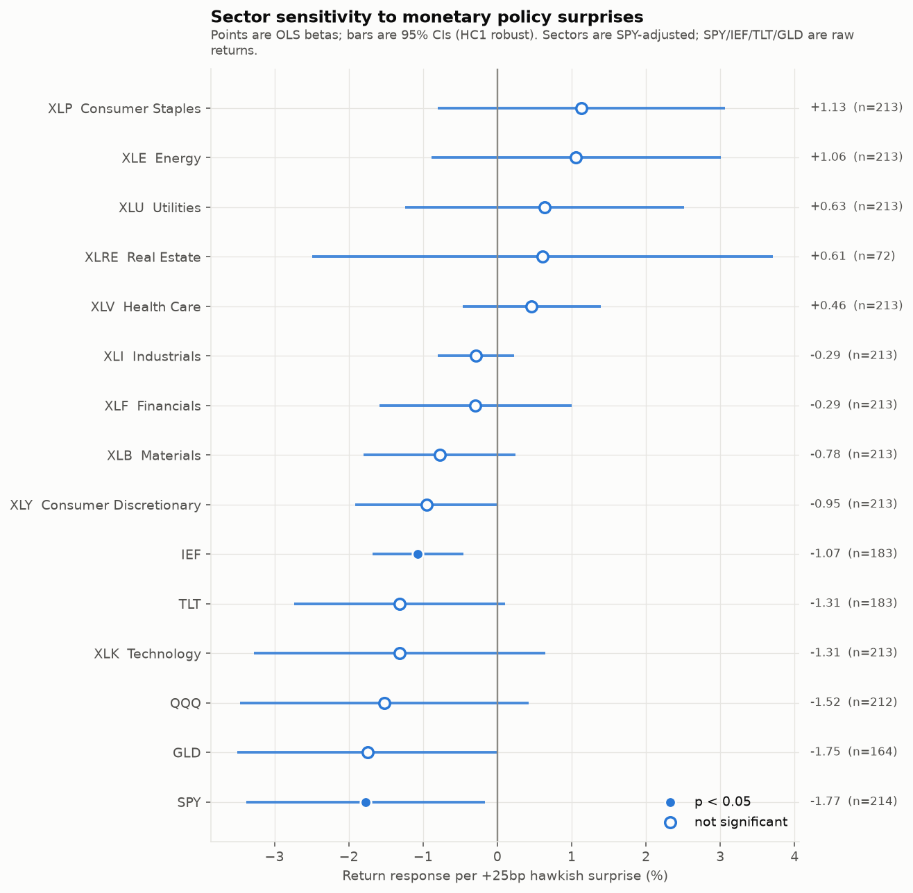
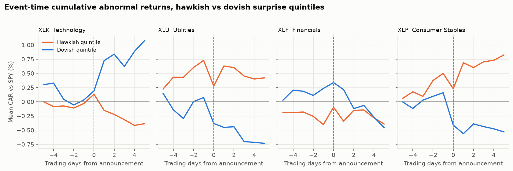
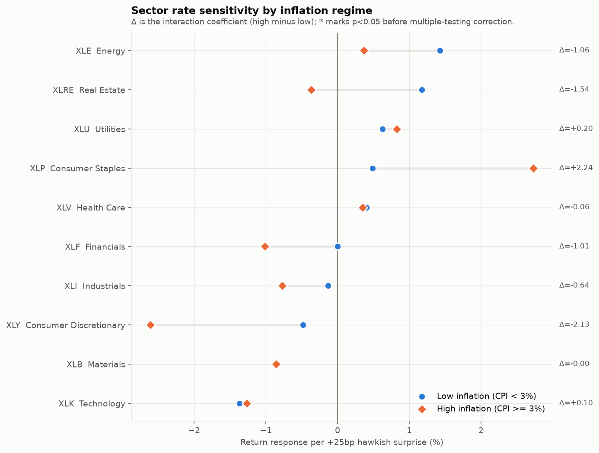
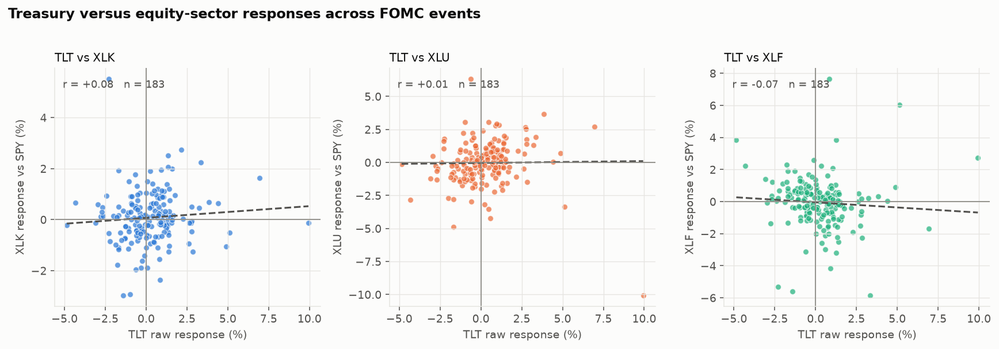
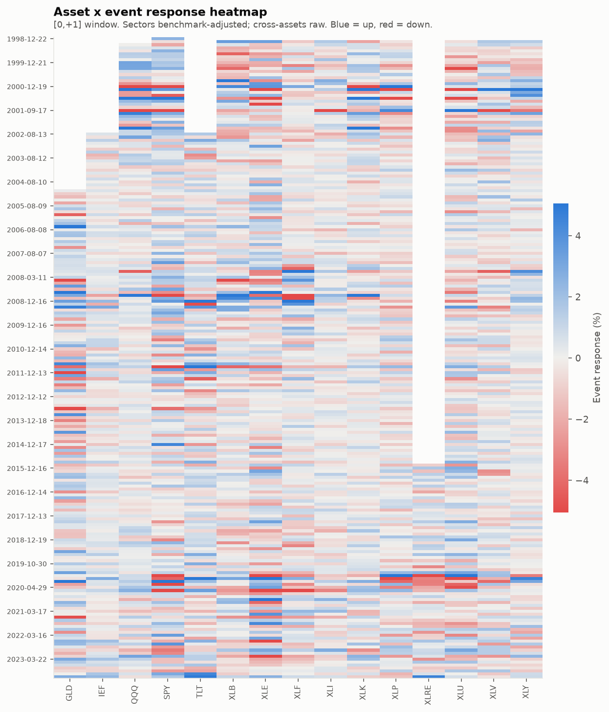
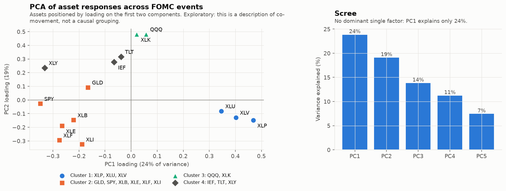
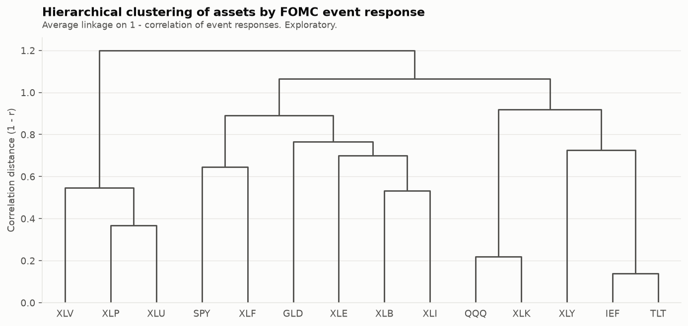
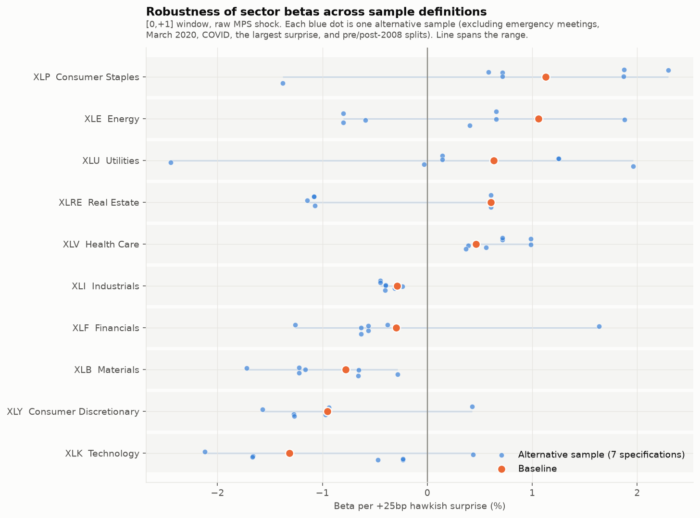

# Which Industries Flinch Most When the Fed Surprises Markets?

### An event study of U.S. equity sector responses to high-frequency monetary policy surprises, 1998–2023

---

## Abstract

We estimate how U.S. equity sectors respond to *unexpected* Federal Reserve
policy announcements, and whether that sensitivity differs between high- and
low-inflation regimes. Identification comes from the Bauer–Swanson (2023)
high-frequency monetary policy surprise — the first principal component of
30-minute changes in Eurodollar/SOFR futures around FOMC announcements —
applied to 215 announcements between December 1998 and December 2023, every
one of which we validate against the Federal Reserve's own announcement
history. Sector responses are measured as SPY-adjusted abnormal returns over a
[0,+1] trading-day window; Treasuries and gold enter on a raw-return basis.

Three findings survive scrutiny. First, the **aggregate market response is
large and well identified**: a 25bp hawkish surprise moves SPY by
**−1.77%** (95% CI [−3.38, −0.16]), and the mechanical bond response is the
cleanest result in the study (IEF **−1.07%**, p = 0.001, wild-bootstrap
p = 0.003). Second, **cross-sectional dispersion across sectors is real but
individually imprecise**: the ordering runs from Technology (−1.32%) and
Consumer Discretionary (−0.95%) at the rate-sensitive end to Consumer Staples
(+1.13%) and Energy (+1.06%) at the defensive end, but *no single sector's
benchmark-adjusted beta is statistically distinguishable from zero at the 5%
level*. Only a pooled test of cyclicals (−0.67%, p = 0.029) clears
conventional significance. Third, and contrary to our pre-registered prior,
**we find no broad evidence that sector rate-sensitivity intensifies in
high-inflation regimes**: 14 of 15 interaction terms are insignificant, and the
one equity interaction that approaches significance (Consumer Discretionary,
p = 0.056) reverses sign when the inflation threshold is moved from 3% to 2%.

The honest headline is that with ~200 events and a surprise standard deviation
of 5.9bp, this design has enough power to identify the *market-wide* and *bond*
response but not to resolve individual sector betas. We report that as the
result rather than searching for a specification that manufactures stars.

---

## 1. Monetary policy expectations and identification

### 1.1 A rate change is not a rate surprise

Asset prices respond to news, not to levels. If the FOMC delivers exactly the
25bp hike that futures markets had already priced, the discount rate embedded
in equity valuations does not move, and neither should equities. Regressing
returns on the *realized* target change therefore estimates a coefficient
contaminated by everything the market already knew.

Our data show this directly. Across the 215 in-sample announcements the
correlation between the raw target change and the high-frequency surprise is
only **0.467** (Figure 2, right panel). More strikingly, of the 215
announcements, **144 involved no change in the target at all** — yet those
"hold" meetings still carry surprises with a standard deviation of **4.0bp** and
a maximum absolute surprise of **15.2bp**, because the FOMC moved expectations
through guidance rather than through the current-period rate. A design keyed on
`raw_change_bps` would discard all of that variation and mismeasure the rest.

We therefore use the surprise as the primary regressor throughout, and report
raw-target-change results only as a clearly labelled exploratory contrast
(§7.4). **The two are never substituted for one another.**

### 1.2 The surprise measure

We use the updated **Bauer & Swanson (2023)** series published by the Federal
Reserve Bank of San Francisco. `MPS` is the first principal component of
30-minute changes in the first four Eurodollar futures contracts (SOFR futures
from January 2023) around each FOMC announcement, scaled so its loading on the
four-quarter-ahead contract equals one. The 30-minute window is narrow enough
that essentially no other macroeconomic news enters it, which is what buys the
identification.

We also report results for `MPS_ORTH`, Bauer–Swanson's version orthogonalized
against six pre-announcement macro/financial variables. This addresses the
"Fed information effect" — the concern that a surprise partly reveals the Fed's
private read on the economy rather than a pure policy shock. `MPS_ORTH` is
undefined for March–December 2020 by construction, so it uses 202 rather than
215 events.

**Sign convention.** `surprise_bps > 0` means futures-implied rates repriced
*upward*: policy was **tighter than expected**. We verify this rather than
assert it: regressing Bauer–Swanson's own 30-minute 10-year Treasury yield
response on the surprise gives a slope of **+0.44 (t = 7.0, R² = 0.39)**. A
hawkish surprise raises yields, as it must. This check is a unit test
(`test_positive_surprise_raises_treasury_yields`).

### 1.3 Event database

215 announcements, 1998-12-22 to 2023-12-13, of which **15 are unscheduled**.
Every date was validated against the Federal Reserve's own records: 207 matched
a statement URL on the Board's FOMC calendars, 5 matched minutes/meeting
materials, and the remaining 3 — all unscheduled — were confirmed by fetching
the press release and reading its title:

| Date | Confirmed release |
|---|---|
| 2007-08-17 | Federal Reserve Board discount rate action |
| 2008-01-22 | FOMC statement (−75bp emergency cut) |
| 2020-03-19 | Temporary U.S. dollar liquidity arrangements with other central banks |

**Zero events remain unvalidated.**

---

## 2. Hypotheses

Directional priors were written and **committed to git before any regression was
estimated** (`docs/HYPOTHESES.md`; see the commit preceding all results
commits). They are reproduced here unaltered, with outcomes filled in
afterward. Where a prior was wrong we say so.

| # | Asset | Prior (vs SPY) | Reasoning | Outcome |
|---|---|---|---|---|
| H1 | Financials | Positive (weak) | NIM expands with reinvestment yields | ✗ Wrong sign (−0.29), insignificant |
| H2 | Technology | Negative | Long-duration cash flows | ✓ Sign correct (−1.32), insignificant |
| H3 | Utilities | Negative | Bond proxy | ✗ Wrong sign (+0.63), insignificant |
| H4 | Real Estate | Negative, largest magnitude | Highest duration + leverage | ✗ Wrong sign (+0.61), only n=72 |
| H5 | Consumer Discretionary | Negative | Financed consumption | ✓ Sign correct (−0.95), p = 0.053 |
| H6 | Long Treasuries | Negative, large | Mechanical duration effect | ✓ Confirmed (−1.31; −4.37 over [−5,+5]) |

Secondary priors: Staples positive ✓ (+1.13); Energy ambiguous ✓ (+1.06,
insignificant); IEF negative ✓ (−1.07, p = 0.001); Gold negative ✓ (−1.75,
p = 0.051).

**Score: 6 of 10 priors correct in sign, 4 wrong.** The three duration-based
equity priors that failed (H1, H3, H4) are discussed in §5.3.

---

## 3. Data

Full detail in [`docs/DATA_PROVENANCE.md`](../docs/DATA_PROVENANCE.md).

Ten SPDR sector ETFs (XLF, XLK, XLU, XLRE, XLY, XLP, XLI, XLE, XLV, XLB),
benchmarks SPY and QQQ, and cross-assets IEF, TLT, GLD. Inception dates bind:
XLRE only exists from October 2015 (**72 events**), GLD from November 2004
(164), IEF/TLT from July 2002 (183). Bitcoin is downloaded but held out of all
headline results because 24/7 trading makes its daily bar non-comparable to a
09:30–16:00 ET equity session.

**Inflation regime.** At each announcement we attach the most recently
*released* CPI report, using a backward as-of merge of the announcement
timestamp against the BLS release timestamp (08:30 ET). Release dates are
scraped from the BLS news-release archive — 390 observed
(reference month → release date) pairs, not assumed. The single gap in the
series is October 2025, which BLS never published because of the 2025 lapse in
appropriations; it falls outside our sample.

This matters: naively merging on calendar month would attach CPI figures
published *weeks after* the meeting. Observed lags between the latest CPI
release and the announcement span **0.23 to 34.24 days**, so the ordering is
genuinely ambiguous without real release dates.

High inflation is defined as latest released headline CPI YoY ≥ 3%, giving
**62 high-inflation and 153 low-inflation events**. Critically, the
high-inflation events are *not* confined to the recent episode: they span
2000–2001, 2003–2008, 2011, and 2021–2023. This is a genuine regime variable,
not a disguised 2022 dummy.

---

## 4. Event-study design

Day 0 is the equity trading day containing the announcement (statements land at
14:00 ET, before the 16:00 close; the Sunday 2020-03-15 announcement rolls
forward to Monday). Window returns are sums of daily log returns in percent.

Baseline dependent variable for sectors:

$$AR_{i,e} = R_{i,e} - R_{SPY,e}$$

over **[0,+1]**, pre-registered. `[-5,+5]`, `[-1,+1]` and `[0,+5]` are reported
throughout. Because the question is *which sectors flinch most*, the
benchmark-adjusted return is the right object: a hawkish surprise pushes
essentially the entire market down (**9 of 10 sectors have a negative raw beta**,
ranging from −0.65 for Staples to −3.09 for Technology; the exception is XLRE at
+1.52 on only 72 events), so raw betas largely re-estimate the market response.
Subtracting SPY isolates relative sensitivity.

**Cross-assets use raw returns.** Subtracting an equity benchmark from a
Treasury return is not an abnormal return — it injects equity noise into a bond
response. Doing so obscures the result completely: TLT's SPY-adjusted beta is
+0.15, while its correct raw beta is −1.31. This is enforced in code
(`config.default_dep`) and tested.

Primary specification, estimated per asset:

$$AR_{i,e} = \alpha_i + \beta_i \cdot Shock_e + \varepsilon_{i,e}$$

with HC1 heteroskedasticity-robust standard errors. Betas are reported as
**percent per +25bp hawkish surprise**. Announcements are ~6 weeks apart and
windows do not overlap, so there is no overlap-induced autocorrelation; we
report HC0/HC3 and a Rademacher wild bootstrap instead, which matter more at
this sample size.

---

## 5. Results

### 5.1 The market and bond responses are well identified

| Asset | Return basis | β per +25bp | Robust SE | 95% CI | p | Bootstrap p | n | R² |
|---|---|---|---|---|---|---|---|---|
| SPY | raw | **−1.77** | 0.82 | [−3.38, −0.16] | **0.031** | 0.077 | 214 | 0.041 |
| GLD | raw | −1.75 | 0.89 | [−3.50, +0.01] | 0.051 | 0.079 | 164 | 0.025 |
| QQQ | vs SPY | −1.52 | 0.99 | [−3.47, +0.43] | 0.126 | 0.184 | 212 | 0.046 |
| XLK Technology | vs SPY | −1.32 | 1.00 | [−3.27, +0.64] | 0.188 | 0.316 | 213 | 0.037 |
| TLT | raw | −1.31 | 0.72 | [−2.73, +0.10] | 0.069 | 0.104 | 183 | 0.026 |
| IEF | raw | **−1.07** | 0.31 | [−1.68, −0.46] | **0.001** | **0.003** | 183 | 0.080 |
| XLY Cons. Discretionary | vs SPY | −0.95 | 0.49 | [−1.92, +0.01] | 0.053 | 0.068 | 213 | 0.038 |
| XLB Materials | vs SPY | −0.78 | 0.52 | [−1.80, +0.24] | 0.136 | 0.180 | 213 | 0.015 |
| XLF Financials | vs SPY | −0.29 | 0.66 | [−1.59, +1.00] | 0.654 | 0.725 | 213 | 0.002 |
| XLI Industrials | vs SPY | −0.29 | 0.26 | [−0.80, +0.22] | 0.266 | 0.279 | 213 | 0.007 |
| XLV Health Care | vs SPY | +0.46 | 0.47 | [−0.47, +1.39] | 0.328 | 0.352 | 213 | 0.008 |
| XLRE Real Estate | vs SPY | +0.61 | 1.58 | [−2.49, +3.71] | 0.701 | 0.807 | **72** | 0.006 |
| XLU Utilities | vs SPY | +0.63 | 0.96 | [−1.24, +2.51] | 0.508 | 0.554 | 213 | 0.007 |
| XLE Energy | vs SPY | +1.06 | 0.99 | [−0.89, +3.01] | 0.286 | 0.350 | 213 | 0.011 |
| XLP Cons. Staples | vs SPY | +1.13 | 0.99 | [−0.80, +3.06] | 0.252 | 0.276 | 213 | 0.027 |

The two results that clear conventional significance are the ones with the
strongest theoretical priors: the **aggregate market** (SPY, p = 0.031) and the
**intermediate Treasury** (IEF, p = 0.001, R² = 0.080, bootstrap p = 0.003).
IEF is the single most precisely estimated coefficient in the study, which is
exactly what should happen — its response is close to mechanical.

**No individual sector beta is significant at 5%.** XLY comes closest
(p = 0.053). We state this plainly: the cross-sectional ordering below is
suggestive, not established.

### 5.2 The ordering is economically coherent even where imprecise

Reading down the forest plot, the sectors sort almost exactly as duration
intuition predicts at the negative end — Technology and QQQ most rate-sensitive,
then Consumer Discretionary and Materials — and defensives (Staples, Health
Care) at the positive end. A pooled test with event-clustered standard errors,
which has more power than any single-asset regression, confirms the cyclical
end:

| Group | β per +25bp | SE | p | n | events |
|---|---|---|---|---|---|
| Cyclicals (XLY, XLI, XLB) | **−0.67** | 0.31 | **0.029** | 639 | 213 |
| Long-duration (XLK, XLU, XLRE) | −0.24 | 0.31 | 0.443 | 498 | 213 |
| Defensives (XLP, XLV, XLU) | +0.74 | 0.67 | 0.267 | 639 | 213 |
| All sectors | −0.02 | 0.20 | 0.915 | 1989 | 213 |

Cyclicals underperform the market on hawkish surprises (p = 0.029). "All
sectors" is ≈ 0 by construction — the SPY-adjusted betas must roughly average
out, which is a useful internal consistency check.

The "long-duration" grouping fails, and the reason is §5.3.

### 5.3 Three duration priors were wrong, and the reason is informative

We predicted Utilities and Real Estate would be the *most* rate-sensitive
sectors. Both came out with the **wrong sign** (+0.63 and +0.61). Financials
also flipped (−0.29 versus a predicted positive).

We are not going to rewrite the hypothesis. The most likely explanation is that
these sectors are simultaneously **bond proxies and low-beta defensives**. A
hawkish surprise does two things: it raises the discount rate (hurting
bond-proxy valuations) and it drives a broad market selloff (in which low-beta
sectors outperform). Because our dependent variable is *benchmark-adjusted*,
the second channel is exactly what we are measuring, and for Utilities it
evidently dominates. The clustering evidence in §7 supports this: Utilities
groups with Staples and Health Care (the defensive cluster), **not** with
Treasuries.

Real Estate is additionally the weakest-identified asset in the study: XLRE has
only **72 events**, all post-2015, and a CI spanning [−2.49, +3.71]. It is
consistent with essentially any hypothesis, and we draw no conclusion from it.

### 5.4 Window sensitivity

Betas by window (baseline sample, raw MPS):

| Asset | [−5,+5] | [−1,+1] | **[0,+1]** | [0,+5] |
|---|---|---|---|---|
| TLT | −4.37 | −1.14 | −1.31 | −3.73 |
| IEF | −2.31 | −0.94 | −1.07 | −1.88 |
| XLK | −2.67 | −1.31 | −1.32 | −2.03 |
| QQQ | −3.09 | −1.27 | −1.52 | −2.40 |
| XLU | +1.65 | +0.72 | +0.63 | +0.66 |
| XLP | +1.66 | +1.11 | +1.13 | +1.02 |

Signs are stable across windows for the well-identified assets. Magnitudes grow
with window length, which is expected — but wider windows also admit more
non-FOMC news, so we do not treat [−5,+5] as a cleaner estimate. Notably TLT's
duration advantage over IEF (~17y vs ~7y) only shows up over the longer window
(−4.37 vs −2.31); at [0,+1] the two are similar, reflecting how much daily noise
swamps a 5.9bp shock.

### 5.5 The daily window costs most of the power

Because Bauer–Swanson ships the 30-minute S&P 500 e-mini response, we can
quantify what the daily window costs — keeping intraday and daily estimates in
**separate coefficients**, never mixed:

| Specification | β per +25bp | t | R² | n |
|---|---|---|---|---|
| **Intraday (30-min), raw MPS** | −1.32 | −4.00 | 0.154 | 214 |
| **Intraday (30-min), MPS_ORTH** | −1.61 | −5.07 | 0.250 | 202 |
| Daily [0,+1] SPY, raw MPS | −1.77 | −2.16 | 0.041 | 214 |
| Daily [0,+1] SPY, MPS_ORTH | −2.73 | −3.50 | 0.091 | 202 |

Point estimates agree; precision collapses. R² falls from 0.25 to 0.09 moving
from a 30-minute window to a two-day window. **This is the central power
limitation of the study**, and it is a property of using daily ETF data, not of
the surprise measure. It also explains why sector-level daily betas are
individually insignificant: sector ETFs have no intraday counterpart in this
dataset.

The orthogonalized shock is consistently *stronger* than the raw shock, exactly
as Bauer–Swanson argue it should be. Under `MPS_ORTH`, XLY (−1.02, p = 0.012)
and XLP (+1.82, p = 0.030) both become significant, and XLRE flips to the
predicted negative sign (−0.69) — though still insignificant with n = 60.

---

## 6. Inflation interactions

$$AR = \alpha + \beta_1 Shock + \beta_2 High + \beta_3 (Shock \times High) + \varepsilon$$

| Asset | β low regime | β high regime | β₃ interaction | SE | p | n high / low |
|---|---|---|---|---|---|---|
| GLD | −3.44 | +0.75 | **+4.19** | 1.95 | **0.032** | 48 / 116 |
| XLY | −0.48 | −2.61 | −2.13 | 1.12 | 0.056 | 62 / 152 |
| XLP | +0.49 | +2.73 | +2.25 | 2.34 | 0.337 | 62 / 152 |
| TLT | −1.99 | −0.45 | +1.55 | 1.39 | 0.266 | 51 / 132 |
| XLF | +0.00 | −1.01 | −1.01 | 1.44 | 0.482 | 62 / 152 |
| XLI | −0.13 | −0.77 | −0.64 | 0.58 | 0.264 | 62 / 152 |
| IEF | −1.36 | −0.80 | +0.56 | 0.65 | 0.390 | 51 / 132 |
| XLK | −1.37 | −1.27 | +0.10 | 2.43 | 0.966 | 62 / 152 |
| XLU | +0.62 | +0.83 | +0.20 | 1.91 | 0.915 | 62 / 152 |
| (XLE, XLV, XLB, XLRE, QQQ, SPY) | — | — | all \|p\| > 0.6 | | | |

**The pre-registered amplification hypothesis is not supported.** We predicted
that rate-sensitive sectors would become *more* rate-sensitive in high-inflation
regimes. Across 15 assets, 13 interaction terms have p > 0.25. The two
exceptions require care, and they behave very differently under scrutiny:

**Gold (β₃ = +4.19, p = 0.032) — robust.** Gold's response to hawkish
surprises is strongly negative in low-inflation regimes (−3.44) and
indistinguishable from zero in high-inflation regimes (+0.75). This is
*attenuation*, our alternative hypothesis B, and it is economically sensible:
when inflation is high, the inflation-hedge demand for gold offsets the
higher-real-rate channel. It holds across **every** alternative threshold we
tested (β₃ between +2.99 and +4.59 for thresholds of 2%, 2.5%, 3%, 3.5%, 4%;
p ≤ 0.037 at four of the five).

**Consumer Discretionary (β₃ = −2.13, p = 0.056) — not robust.** This is
amplification, and it is the one equity result pointing the way we predicted:
XLY's sensitivity goes from −0.48 in low inflation to −2.61 (p = 0.008) in high
inflation. But it **does not survive the threshold sensitivity check**:

| Threshold | β₃ | p | n high / low |
|---|---|---|---|
| 2.0% | **+0.38** | 0.634 | 132 / 82 |
| 2.5% | −0.99 | 0.318 | 95 / 119 |
| **3.0%** | **−2.13** | **0.056** | 62 / 152 |
| 3.5% | −1.50 | 0.207 | 45 / 169 |
| 4.0% | −0.79 | 0.551 | 30 / 184 |

The coefficient **changes sign** between the 2% and 3% cutoffs. We treat this
as an artifact of a particular threshold, not a finding.

**Multiple testing.** We estimate 15 interaction coefficients. A Bonferroni
threshold would be 0.05/15 = 0.0033; neither GLD (0.032) nor XLY (0.056) clears
it. Gold's result is supported by its stability across thresholds rather than
by its nominal p-value, and we present it as suggestive.

The full battery — 465 interaction estimates across five thresholds, three
sample filters, two windows, and a threshold-free median split — is persisted
in `results/tables/robustness_interaction.csv`.

**Answer to the research question:** *for equities, we find no reliable evidence
that sector rate-sensitivity changes between high- and low-inflation regimes.*
The clearest regime dependence in the data is in gold, not in equity sectors.

---

## 7. Cross-asset analysis

### 7.1 Correlation of event responses

Pairwise correlations of event responses ([0,+1], pairwise-complete, minimum 60
shared events):

| | TLT | IEF | GLD | XLK | XLU |
|---|---|---|---|---|---|
| **XLK** | 0.08 | 0.01 | 0.11 | 1.00 | −0.42 |
| **XLU** | 0.01 | 0.09 | 0.08 | −0.42 | 1.00 |
| **XLF** | −0.07 | −0.06 | −0.07 | −0.27 | −0.22 |
| **XLP** | −0.09 | −0.05 | −0.15 | −0.62 | 0.66 |
| **XLY** | 0.32 | 0.24 | 0.07 | 0.19 | −0.33 |

The striking feature is how *weak* the bond–equity links are. Sector responses
correlate strongly **with each other** (XLK↔XLP = −0.62, XLU↔XLP = +0.66,
XLK↔XLU = −0.42) but barely at all with Treasuries (|r| ≤ 0.32). Around FOMC
announcements, the dominant axis of equity-sector variation is
**cyclical-versus-defensive rotation**, not shared duration exposure with bonds.

XLY is the exception: it is the only sector with a meaningful positive
correlation to Treasuries (TLT 0.32, IEF 0.24), which is consistent with
Discretionary being the most genuinely rate-sensitive sector in the equity
complex — and with its being the equity sector that shows the amplification
pattern in §6, tentative as that is.

### 7.2 Heatmap

---

## 8. PCA and clustering (exploratory)

PCA on the complete 164-event × 14-asset standardized response matrix (XLRE
excluded — 72 events is too few for a balanced panel; this is recorded in
`summary.json`).

**No dominant factor**: PC1 explains only **23.9%**, PC2 19.2%, PC3 13.9%. A
single "rate factor" does not drive FOMC-day co-movement.

Hierarchical clustering (average linkage on correlation distance, 4 clusters):

| Cluster | Members | Reading |
|---|---|---|
| 1 | XLP, XLU, XLV | **Defensives** |
| 2 | GLD, SPY, XLB, XLE, XLF, XLI | **Broad market / cyclicals** |
| 3 | QQQ, XLK | **Long-duration growth** |
| 4 | IEF, TLT, XLY | **Duration** — Treasuries *plus* Consumer Discretionary |

Does the data group economically similar rate-sensitive assets together?
**Partly.** Cluster 4 is the interesting one: the two Treasury funds cluster
with Consumer Discretionary rather than with Utilities or Staples. (Real
Estate, whose textbook duration story is the strongest of all, is absent from
the clustering entirely — its 72-event history is too short to admit.) This is
the same message as §7.1 and §5.3 — around FOMC announcements the sector that
actually behaves like a duration asset is Discretionary, while Utilities
behaves like a defensive. Our pre-registered "bond proxy" intuition for
Utilities is not what the data show.

This section is descriptive. We make no causal claim from it.

---

## 9. Robustness

**2,886 primary estimates and 465 interaction estimates are persisted** to
`results/tables/robustness_all.csv` and `robustness_interaction.csv`. Nothing
was run and discarded.

The battery crosses 8 sample filters (baseline; excluding emergency meetings;
excluding March 2020; excluding the COVID period; excluding the largest
surprise; scheduled-only; pre-2008; post-2008) × 4 windows × 2 shock measures ×
3 return definitions, plus HC0/HC3 and a wild bootstrap.

**What holds:**
- IEF's sign and magnitude are essentially invariant (range −1.12 to −1.07
  across all eight samples).
- TLT, GLD, QQQ, XLB, XLI and XLV never change sign across any of the eight
  sample filters.
- The intraday and daily point estimates agree.

**What does not:**
- **Seven of the ten sectors change sign somewhere in the battery** — XLF, XLK,
  XLU, XLRE, XLY, XLP and XLE — as does SPY. Utilities ranges from −2.44 to
  +1.96. These sectors are not reliably signed.
- The instability is concentrated in one filter. Across the six exclusion-type
  samples (baseline, ex-emergency, ex-March-2020, ex-COVID, ex-largest-surprise,
  scheduled-only) only XLU, XLE and XLRE flip. Adding the pre/post-2008
  sub-period split flips XLK, XLY, XLP, XLF and SPY as well: in the post-2008
  sub-sample every one of those betas turns positive. The zero-lower-bound era,
  in which conventional target moves were rare and policy news arrived through
  guidance, is a genuinely different regime, and the cross-section does not
  survive being restricted to it.
- XLRE is unstable under every perturbation and drops an entire sample filter
  (pre-2008) for lack of data.

We flag this rather than bury it: **seven of the ten sector betas are not
sign-stable across the full battery**, which reinforces §5.1 — this design does
not resolve individual sector responses.

**Raw vs benchmark-adjusted.** Nine of ten sectors have a negative raw beta
(−0.65 to −3.09; XLRE is the exception at +1.52 on 72 events), while
benchmark-adjusted betas straddle zero. The benchmark adjustment is doing
exactly what it should: removing the common market response so the remaining
variation is relative sensitivity.

---

## 10. Identification limitations

1. **Statistical power is the binding constraint.** 215 events, surprise SD of
   5.9bp. To detect a true sector beta of 1% per 25bp against the observed
   residual noise, we would need several times this many events. Confidence
   intervals of ±2–3 percentage points on sector betas are the honest output.
   The FOMC meets eight times a year; this constraint cannot be relaxed by
   better econometrics, only by intraday sector data or a longer sample.

2. **Daily windows admit non-FOMC news.** §5.5 quantifies the cost: R² drops
   from 0.25 (30-minute) to 0.09 (two-day) for the same shock and asset.

3. **The Fed information effect.** A surprise may reveal the Fed's private
   assessment of the economy rather than a pure policy shock. We report
   `MPS_ORTH` throughout to address this, but orthogonalization is itself a
   modelling choice, and it is undefined for March–December 2020.

4. **Sample ends 2023-12-13.** The Bauer–Swanson update currently extends no
   further. Nothing here speaks to 2024–2026 policy.

5. **XLRE cannot be evaluated.** 72 post-2015 events, no pre-2008 data, unstable
   under every perturbation. Its inclusion in the sector list is for
   completeness; its estimates should not be used.

6. **The regime split is a coarse proxy.** A 3% CPI cutoff is a blunt
   instrument for "inflation regime," which is why we test five thresholds and
   a median split. That the one equity interaction reverses sign across
   thresholds is evidence about the fragility of threshold-based regime
   definitions generally.

7. **Benchmark-adjusted returns confound duration with market beta.** A
   low-beta sector mechanically outperforms in a selloff. Our AR measure
   assumes a market beta of one for every sector, which is false. This is the
   most likely explanation for the Utilities result (§5.3) and a genuine
   limitation of the beta-of-one adjustment, chosen because estimating per-sector
   betas on an estimation window introduces its own look-back choices and noise.

8. **No causal claim beyond the announcement window.** The design identifies
   the response of asset prices to policy news within a one-to-two day window.
   It says nothing about the effect of monetary policy on the real economy, on
   longer-horizon returns, or on sector fundamentals.

---

## 11. Conclusion

Unexpected FOMC announcements move U.S. equity markets by an economically large
amount — about **−1.8% per 25bp of hawkish surprise** for the S&P 500 — and
their effect on Treasuries is precise enough to be near-mechanical
(IEF: −1.07%, p = 0.001). Those two results are solid.

The cross-sectional question the project set out to answer — *which industries
flinch most* — receives a more qualified answer. The ordering is economically
coherent, with Technology, Consumer Discretionary and Materials at the
rate-sensitive end and Consumer Staples, Energy and Health Care at the
defensive end, and a pooled test of cyclicals is significant (−0.67%,
p = 0.029). But **no individual sector beta is statistically distinguishable
from zero at the 5% level**, and seven of ten are not sign-stable across the
full robustness battery. Three of our six pre-registered directional
priors — Financials, Utilities and Real Estate — came out with the wrong sign.

On the inflation-regime question, the pre-registered amplification hypothesis
**is not supported for equities**. Thirteen of fifteen interaction terms are
insignificant; the one equity exception reverses sign when the threshold moves
from 3% to 2%. The single regime effect that survives threshold sensitivity is
in **gold**, which stops responding to policy surprises when inflation is high —
attenuation, our alternative hypothesis, and only in the asset where an
inflation-hedge channel is most obviously available.

The most useful methodological finding is §5.5: moving from a 30-minute to a
two-day window cuts explanatory power by roughly two-thirds for an identical
shock and asset. Sector-level questions of this kind are answerable, but they
need intraday sector data, not more clever econometrics applied to daily bars.

---

*Every number in this report is generated by `scripts/run_analysis.py` and
persisted under `results/`. Hypotheses were committed before estimation. All 61
tests pass.*
